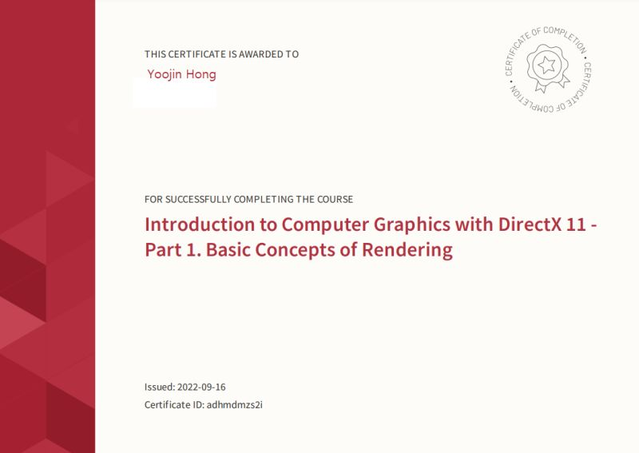
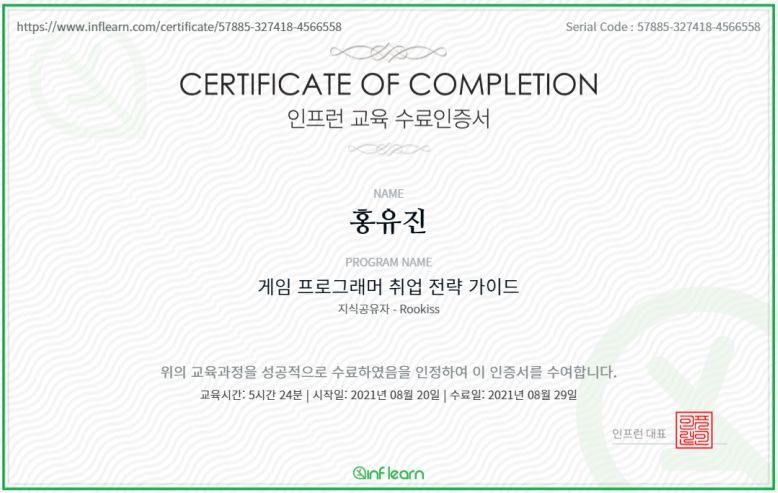

# GameDev Certifications

## Honglab: Graphics basic part1, basic concepts of rendering

## Inflearn: GameDev Employment Stargy

## Inflearn: MMORPG - Unity - Part4 UnityEngine, rookiss

## Inflearn: Unreal4 Cpp Basic, rookiss

