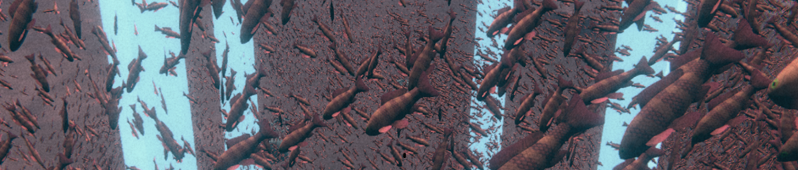

<h1 align="center">⚡Client Developer⚡</h1>

  </a>&nbsp 
  </a>&nbsp 
  </a>&nbsp 
   
  </a>&nbsp 
  </a>&nbsp 
  </a>&nbsp 
   
   

<h3 align="center">🛠 <a href="./TechStack.md">Detail Teck stack</a> 🛠</h3>
 

<h3 align="center"> 📫 How to reach me 📫 </h3>

  &nbsp
  &nbsp

  
  

## &#x1F6A9; Achieve
2014 인천전자마이스터고 MDP 과제발표회 - <a href="https://doobudubu.tistory.com/169?category=958833">3등 수상</a> 
2021 방송통신대학교 총장배 소프트웨어 경진대회 - 동상 수상 
2021 에듀테크쇼 초등교육전 - 에듀테크 애플리케이션상 수상(ARgong2, DNSOFT) 
2022 방송통신대학교 총장배 소프트웨어 경진대회 - 은상 수상 
2022 방송통신대학교 졸업생 성적우수상 
 

고졸: 인천전자마이스터고 전자제어과 
학사: <a href="./knou.md">방송통신대학교</a> 컴퓨터과학: 4.4/4.5
  

<h2>&#x1F3E3; Private Projects</h2>
2021 인천전자마이스터고 게인미 VR 및 게임콘텐츠 제작 동아리 강사 - 2학기 
 

<h2>&#x1f4c8; GitHub Stats</h2>

  

